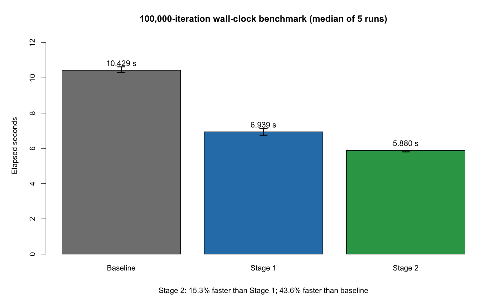
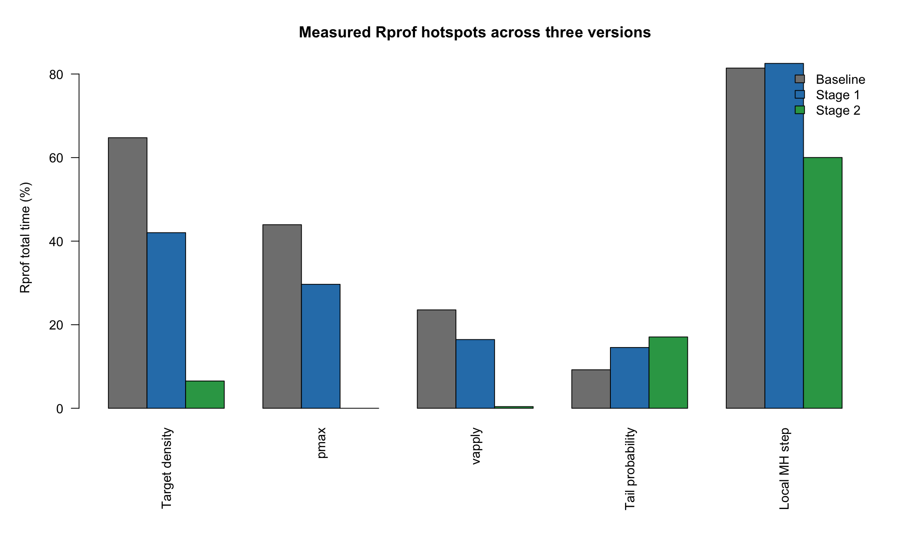
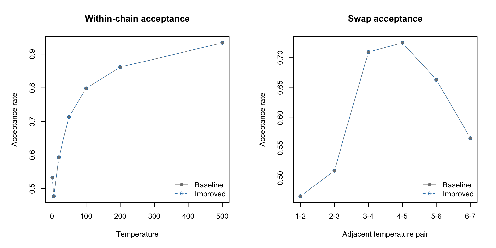

# Question 4: profiling code performance

## Scope

This folder profiles the same `pt_sampler_trunc()` used for Question 3. The statistical workload remained fixed: seed 1, 100,000 iterations, seven chains starting at 5, temperatures `(1, 5, 20, 50, 100, 200, 500)`, proposal scales `(1, 3, 6, 10, 14, 18, 20)`, lower bound 2 and adjacent swaps every five iterations.

## Included evidence

- `profiling/baseline_Rprof.out`: raw baseline `Rprof()` samples.
- `profiling/*_Rprof_summary.txt`: baseline, Stage 1 and Stage 2 summaries.
- `profiling/stage2_runtime_replicates.csv` and `stage2_runtime_summary.csv`: alternating same-batch five-run benchmark.
- `profiling/stage2_hotspot_comparison.csv`: extracted profiler comparison.
- `profiling/*sessionInfo.txt`: R and package environment.
- `improved_stage2/pt_sampler_stage2.R`: Stage 2 sampler and scalar target implementation.
- `tests/test_stage2_target.R`: scalar/vector equivalence and support checks.
- `results/stage2_target_validation.csv`: scalar/vector target equivalence.
- `results/baseline_vs_improved_validation.csv` and `stage2_sampler_validation.csv`: full-run checks.
- `figures/`: runtime, hotspot and acceptance-rate figures.

Full sampler RDS objects, profiler RDS files and profvis HTML files are omitted to keep the public package concise.

## Main result

Baseline profiling found `pt_rw_step_trunc` at 81.42% total time, `logf` at 64.76% and `pmax` at 43.93%. `r_trunc_norm` accounted for only 5.55%, so the profiler did not support optimising the visible rejection loop first.

| Function | Baseline total time (%) |
|---|---:|
| `pt_rw_step_trunc` | 81.42 |
| `logf` | 64.76 |
| `pmax` | 43.93 |
| `Z_tail` | 9.22 |
| `r_trunc_norm` | 5.55 |

Stage 1 cached each chain's current target value and evaluated the normal upper-tail correction directly on the log scale. Stage 2 added a validated scalar target evaluator for the scalar-heavy inner loop. The main sampler remained generic.

| Version | Median runtime (s) | Cumulative allocation (MiB) | Sample matrix (MiB) |
|---|---:|---:|---:|
| Baseline | 10.429 | 12,378.9 | 5.341 |
| Stage 1 | 6.939 | 7,324.9 | 5.341 |
| Stage 2 | 5.880 | 5,761.1 | 5.341 |

Stage 2 reduced median runtime by 43.62% relative to baseline. This is a computational result on the recorded machine, not evidence of better mixing, ESS, convergence or posterior accuracy.

## Saved figures

### Runtime comparison

### Profiler hotspot comparison

### Acceptance-rate validation

## Memory interpretation

Rprof cumulative allocation fell from 12,378.9 MiB to 5,761.1 MiB. This is not peak resident RAM. The retained 100,000 by 7 sample matrix remained 5.341 MiB because the algorithm still stored every sample.
